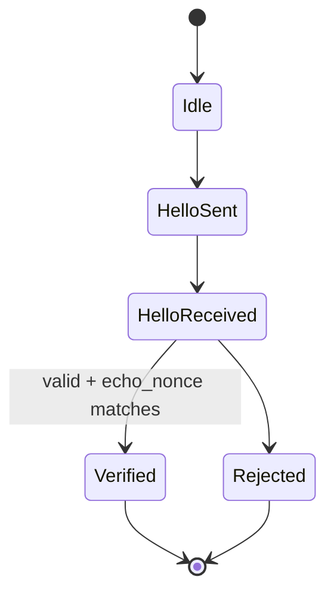

# RFC-KAD3-HANDSHAKE

## Identity Verification and Capability Negotiation

**Status:** Draft  
**Category:** Standards Track  
**Version:** 0.1  
**Author:** rust-mule project  
**Updated:** 2026-02

---

## 1. Abstract

This document defines the KAD3 HELLO handshake protocol.

The handshake establishes:

- NodeID ↔ public key binding
- Proof of private key possession
- Protocol version negotiation
- Capability advertisement
- Endpoint discovery

No peer MAY enter the KAD3 routing table without completing
a valid HELLO exchange.

---

## 2. Goals

The handshake MUST:

- Cryptographically bind NodeID to public key
- Prevent identity spoofing
- Support forward-compatible negotiation
- Be transport-agnostic
- Be replay-resistant
- Advertise supported token scheme(s) in capabilities.

---

## 3. Message Envelope Requirements

All HELLO messages MUST use canonical CBOR encoding.

The signature MUST be computed over the canonical CBOR encoding
of the envelope excluding the `signature` field.

All fields are REQUIRED unless explicitly marked optional.

---

## 4. HELLO Request

### 4.1 Structure

CBOR Map:

```text id="2k6tpu"
{
  "type": "HELLO",
  "version": 3,
  "node_id": <32-byte>,
  "public_key": <bytes>,
  "nonce": <u64>,
  "timestamp": <u64>,
  "capabilities": <map>,
  "endpoints": <array>,
  "signature": <bytes>
}
```

---

### 4.2 Field Definitions

- `type` MUST equal `"HELLO"`
- `version` MUST equal 3
- `node_id` MUST equal HASH(public_key)
- `nonce` MUST be randomly generated per handshake
- `timestamp` MUST be current UNIX time (seconds)
- `capabilities` MUST be a map (may be empty)
- `endpoints` MUST contain ≥ 1 endpoint
- `signature` MUST sign the canonical CBOR of all fields except `signature`

---

## 5. HELLO Response

### 5.1 Structure

Same structure as request, with an additional field:

```text id="clm3sz"
"echo_nonce": <nonce_from_request>
```

The response MUST include the nonce from the request.

---

## 6. Validation Rules (Mandatory)

Upon receiving HELLO:

1. Validate canonical CBOR encoding.
2. Verify signature using provided public key.
3. Compute HASH(public_key) and compare to node_id.
4. Ensure timestamp is within allowed skew window.
5. Ensure nonce not recently seen (replay protection).
6. Validate endpoints structure.

If ANY step fails → reject handshake.

---

## 7. Capability Negotiation

The `capabilities` map MAY include:

```text id="2u0qfi"
{
  "transports": ["udp", "i2p_sam_datagram", "quic"],
  "store": true,
  "max_k": 20,
  "extensions": ["pow-admission"]
}
```

Peers MUST ignore unknown capability fields.

Protocol version mismatch MUST result in rejection unless
explicit backward compatibility is implemented.

---

## 8. Handshake State Machine



---

## 9. Security Properties

The HELLO handshake provides:

- Identity authenticity
- Replay resistance
- Capability negotiation
- Endpoint advertisement

It does NOT provide:

- Confidentiality (transport dependent)
- Sybil resistance
- Trust scoring

---

## 10. Contact Promotion

A peer MUST be promoted to routing table only after:

- Successful HELLO exchange
- Endpoint validation
- Policy approval

No partial promotion allowed.

---

## 11. Failure Handling

- Invalid peers SHOULD be rate-limited.
- Rejected peers MAY be temporarily blacklisted.
- Timeout peers SHOULD be retried conservatively.

---

## 12. Conclusion

The HELLO handshake defines the cryptographic foundation of KAD3.
Without it, KAD3 security guarantees collapse.

```

---
```
